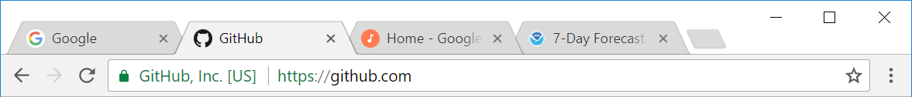
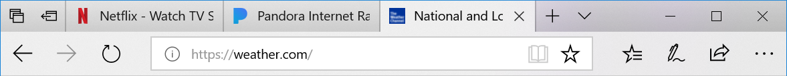
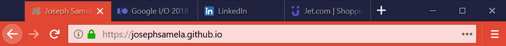

# Colorize Tabs
Since Chrome 39 shipped with Android Lollipop in 2014 developers could customize color of the browser toolbar. [link](<https://developers.google.com/web/updates/2014/11/Support-for-theme-color-in-Chrome-39-for-Android>)
```
meta name="theme-color" content="#db5945">
```
Today many websites support `theme-color` and Chrome for Android looks 🔥🔥🔥


Unfortunately `theme-color` remains unsupported on desktop. Today all major browsers look the same - light gray with favicons. How about we spice things up? 





*Colorize Tabs* is an extension to bring this feature to your favorite browser!




My goal is to support multiple browsers. 

| Browser | Status            |
| ------- |:-----------------:|
| Firefox | beta              |
| Chrome  | under development |
| Edge    | not supported     |
| Safari  | not supported     |
| Opera   | not supported     |
