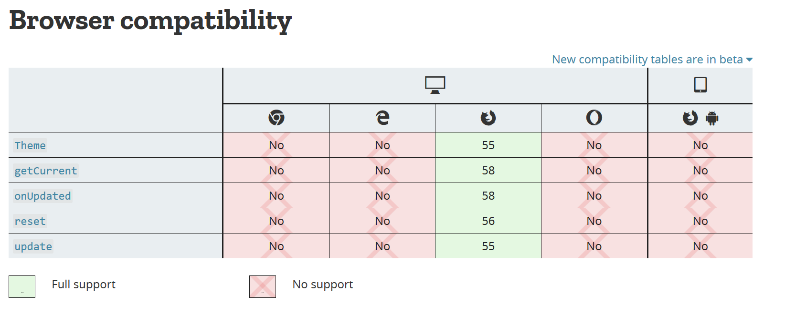

# Colorize Tabs

## What is it?

**Colorize Tabs** is a browser extension that colors tabs to match a website's `theme-color`.


## What's `theme-color`?

Since [Chrome 39](<https://developers.google.com/web/updates/2014/11/Support-for-theme-color-in-Chrome-39-for-Android>) shipped with Android Lollipop in 2014 websites can use `theme-color` to customize the browser toolbar. Simply drop this tag in the head of a webpage!
```
<meta name="theme-color" content="#db5945">
```
Today many websites support `theme-color` and Chrome for Android looks 🔥🔥🔥


Unfortunately `theme-color` still remains unsupported on the desktop - just light gray with favicons.


## Browser Support?

Currently Firefox is the only browser with theme API support. [link](https://developer.mozilla.org/en-US/Add-ons/WebExtensions/API/theme#Browser_compatibility)


